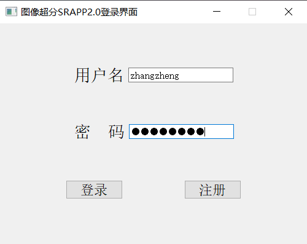
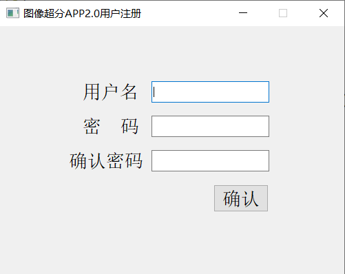
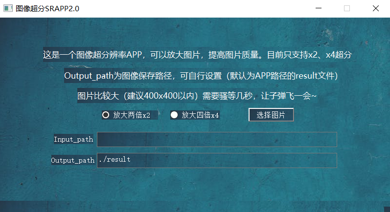
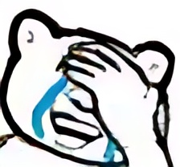

### 一、SRAPP项目是什么?

一个基于c++、QT整合了轻量化图像超分辨率深度学习模型的APP项目。可x2、x4放大图片分辨率（x2超分 输入400x400图片可以得到800x800图片），使低分辨率的图像更加清晰。

后续还可以整合其他深度学习模型如图像分类、目标检测等等。

### 二、所用环境配置

##### 1、Qt 5.14.2

##### 2、OpenCV 4.7.0

##### 3、libtorch 1.7.0

### 三、项目所包含内容

##### 1、socket网络编程，TCP，客户端、服务端业务逻辑

##### 2、QT界面

##### 3、数据库，注册登录功能

##### 4、图像超分辨率深度学习模型c++部署

##### 5、OpenCV图像处理

### 四、效果展示

##### 1、客户端登录、注册界面
 

##### 2、图像超分界面

##### 3、图像超分效果（左边为输入图片，右边为超分输出图片）
###### 3.1 image one
     
###### 3.2 image two
     
###### 3.3 image three
     
###### 3.4 image four
     
###### 3.5 image five
     

### 五、联系作者

可直接github提问

也可联系QQ：1791866021
